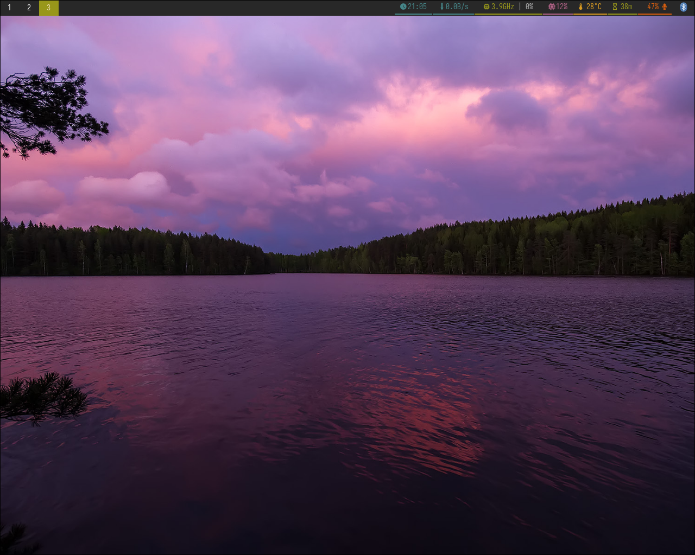

## 🛠️ Software Stack

Below is a detailed list of the software and packages used in this configuration:

| Category | Packages |
| :--- | :--- |
| **Compositor** | `hyprland` |
| **Shell** | `fish` |
| **Terminal** | `foot` |
| **Editors** | `neovim` `nvim-packer-git` (AUR) |
| **Browsers** | `firefox` `vivaldi` |
| **File Managers** | `pcmanfm-qt` `file-roller` |
| **Desktop Portal** | `xdg-desktop-portal` `xdg-desktop-portal-hyprland` `xdg-utils` |
| **Fonts** | `ttf-jetbrains-mono-nerd` `otf-font-awesome` `ttf-hack-nerd` `ttf-iosevka-nerd` |
| **Status Bar** | `waybar` |
| **App Launcher** | `rofi-wayland` |
| **Notifications** | `swaync` |
| **Wallpaper** | `hyprpaper` `waypaper` (AUR) |
| **Screenshot & Clip** | `grim` `slurp` `cliphist` |
| **Sound System** | `pipewire` `pipewire-alsa` `pipewire-pulse` `wireplumber` `pavucontrol` |
| **Media & Control** | `imv` `mpv` `playerctl` `brightnessctl` |
| **Auth & Disk** | `polkit-kde-agent` `udiskie` |
| **Connectivity** | `bluez` `blueman` |
| **Dev Tools & Libs** | `clang` `gdb` `qt5-wayland` `qt6-wayland` |

---

## 🚀 Installation

You can use my automated installation script to set up this configuration easily:

🔗 **Installation Script:** [aktasesat/hyprsetup](https://github.com/aktasesat/hyprsetup)at/hyprsetup](https://github.com/aktasesat/hyprsetup)

